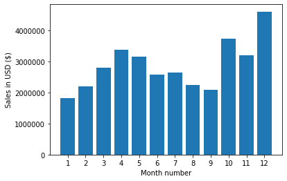
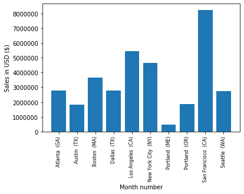
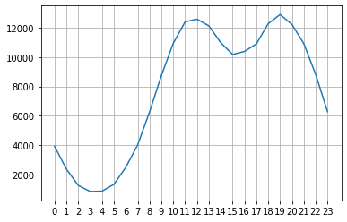
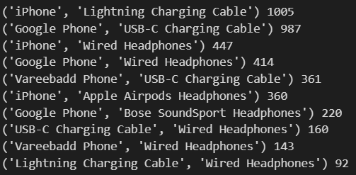
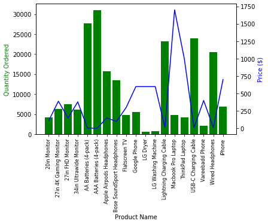

### Data Used

**Data** - HR Data with over 170000 from the year 2019

**Data Analysis** - Pandas and Numpy

**Data Visualization** - Matplotlib

### Questions 

1. What was the best month for sales? How much was earned that month?
2. What city sold the most product?
3. What time should we display advertisements to maximize likelihood of customer's buying product?
4. What products are most often sold together?
5. What product sold the most? Why do you think it sold the most?

### Summary of Findings

1. The month of december have the most sales.

2. The city of San Francisco, California sold the most product.

3. The most active customers are between 9am and 9pm.

4. iPhone and Lightning Charging Cable

5. AAA Batteries (4-pack)
``